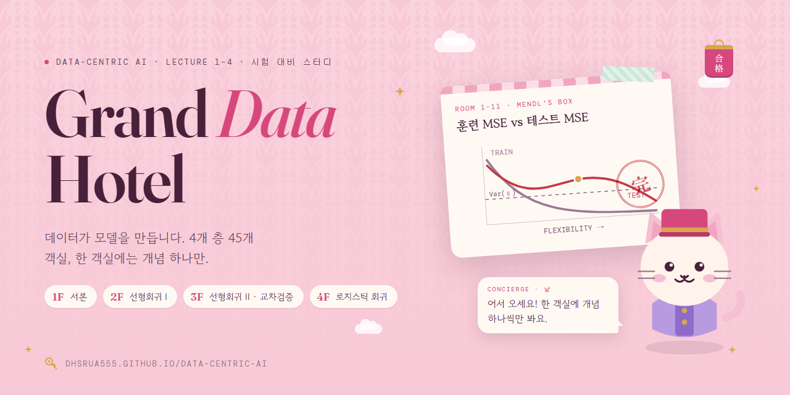

# Grand Data Hotel

Data-Centric AI (서울대, 오민환 교수) Lecture 1–4 시험 대비 스터디 사이트. 강의 하나가 한 층, 개념 하나가 한 객실입니다.

**사이트:** https://dhsrua555.github.io/data-centric-ai/

`index.html`을 브라우저로 열면 바로 동작합니다(로컬 서버 불필요). 수식은 KaTeX(cdnjs), 글꼴은 Google Fonts를 씁니다.

## 구성

| 층 | 강의 | 객실 |
|---|---|---|
| 1F 서론: 데이터가 모델을 만든다 | Lecture 1 (28장) | 12 |
| 2F 선형회귀 I: 최소제곱과 추론 | Lecture 2 (14장) | 8 |
| 3F 선형회귀 II와 교차검증 | Lecture 3 (33장) | 15 |
| 4F 분류: 로지스틱 회귀 | Lecture 4 (17장) | 10 |

객실마다: 컨시어지(냥)의 가이드 → 본문(수식·표) → 시각 자료(대화형 SVG/Canvas) → <b>교수님 강의 노트</b>(녹음에서 뽑은, 슬라이드에 없는 설명·시험 언급) → 시험 포인트(멘들스 상자) → 퀵 체크 퀴즈 → <b>실전 연습</b>(영어 T/F·모두 고르시오·서술, 실제 시험 형식) → 도장. 진행도는 브라우저 localStorage에 저장됩니다.

시험 대비 데스크: 층별 족보(체크리스트 + 공식 + 수업에서 강조한 것 + 용어 사전), 플래시카드 72장, 모의고사 두 종류(작년 형식 그대로의 <b>실전형 100점</b>: T/F 30 · 모두 고르시오 40 · short 20 · long 10, 그리고 객관식 20문 빠른 모의고사), 시험 안내(`#/guide`: 형식·점수 전략·교수님 시험 언급 모음).

## 냥의 옷장 (보상과 꾸미기)

공부하면 냥이 쌓이고, 부티크(`#/boutique`)에서 컨시어지 고양이 냥의 모자·얼굴·목·옷·소품·자리·털색·도장을 사서 꾸밀 수 있습니다. 고른 차림은 사이트의 모든 냥과 객실 도장에 반영됩니다.

옷장으로 가는 길은 여러 곳에 있습니다. 내비게이션의 분홍 <b>옷장</b> 버튼(지금 차림의 냥 얼굴, 보유 냥, 지금 살 수 있는 아이템 수 배지)은 모든 화면에 떠 있고, 프런트에는 첫 화면 버튼과 쇼윈도(살 수 있는 것·다음 목표·최고가·업적 아이템, 누르면 그 아이템을 입혀 본 채로 열림)가 있습니다. 층·객실에서는 냥 발밑의 꼬리표와 도장 옆 링크로 들어가고, 옷장에서는 "공부하던 곳으로" 버튼으로 돌아옵니다. 공부하다 새로 살 수 있는 아이템이 생기면 알림이 뜹니다. 주소 `#/boutique/<슬롯>/<아이템 id>`로 특정 아이템을 바로 열 수 있습니다.

| 활동 | 보상 |
|---|---|
| 객실 도장 | +20냥 (객실마다 한 번) |
| 퀵 체크 정답 | +5냥 (객실별 최고 기록 기준) |
| 층 전체 완료 | +50냥 |
| 족보 포인트 체크 | +2냥 (항목마다 한 번) |
| 플래시카드 한 묶음 완주 | +15냥 (묶음마다 하루 한 번) |
| 빠른 모의고사 | 정답당 +2냥, 16점 이상 +20냥 (하루 3회까지) |
| 실전형 모의고사 | 3점당 1냥 (하루 2회까지), 90점 이상 +30냥 |
| 실전 연습(객실별 영어 문제) | 정답당 +5냥 (객실별 최고 기록), 서술 연습 +5냥 |
| 매일 체크인 | +5냥, 연속이면 하루 +1냥씩 (최대 12냥) |

아이템 60종 중 판매 아이템 42종(합계 4,890냥, 가장 비싼 것은 자리 아이템 핑크 왕좌 500냥, 그다음은 핑크 하트 티아라 400냥)과, 업적으로 여는 특별 아이템 8종(핑크 하트 보석 목걸이(전 객실 도장), 핑크 다이아 왕관(빠른 모의고사 20/20), A+ 금도장(16점 이상), 벚꽃 후리소데(족보 전부 체크), A+ 펜던트(7일 연속 체크인), 핑크 공주 드레스(퀵 체크 전 객실 만점), 황금 트로피(실전형 90점 이상), 핑크 별 요술봉(모든 객실 영어 실전 연습 만점))이 있습니다. 한 번 연 업적 아이템은 나중에 기록이 내려가도(족보 체크 해제, 재응시 점수 하락 등) 잠기지 않고, 판매하다 업적으로 바뀐 별 요술봉은 이미 산 사람에게 그대로 남습니다. 아이템 모양이나 이름을 바꿀 때는 id를 그대로 두어 이미 저장된 보유·착용 기록이 이어지게 합니다. 도장은 체크·A+·100점 꽃동그라미·PASS처럼 성적을 떠올리게 하는 모양이고, 아트에 한자는 쓰지 않습니다. 기능이 생기기 전의 진행도도 처음 열 때 냥으로 적립됩니다.

## 파일

- `assets/style.css` 디자인 토큰과 레이아웃, 페이지 전환(엘리베이터·페이지 넘김) 애니메이션
- `assets/app.js` 라우터(해시), 진행도, 퀴즈·플래시카드·모의고사 엔진, 컨시어지, 꽃잎
- `assets/viz.js` 시각 자료 33종 (`window.VIZ[name](el, opts)`; 본문에서 `

`)
- `assets/nyan.js` 고양이 아트, 꾸미기 아이템, 도장 (`NYAN.render(look)`, `NYAN.stamp(id)`; 모두 손으로 쓴 SVG)
- `data/floor1..4.js` 객실 콘텐츠 (`String.raw` 템플릿, 인라인 `$…$`, 디스플레이 `$$…$$`)
- `data/exam.js` 플래시카드와 모의고사 추가 문제
- `data/lecture.js` 강의 녹음(9/4·9/11·9/18)에서 뽑은 객실별 강의 노트(`HOTEL.lecture`), 실전 연습 문제(`HOTEL.drill`), 실전형 모의고사의 short/long answer 문제 은행(`HOTEL.written`)
- `tools/test.html` 검증 하네스 (헤드리스 Chrome `--dump-dom`으로 실행: KaTeX 오류, 남은 `$`, 시각 자료 오류, 퀴즈 정답 범위, 강의 노트·실전 연습의 형식과 수식, 냥 아이템 전 조합 렌더 검사)
- `publish.html` claude.ai 아티팩트 게시용(문서 골격 없는 버전)

## 콘텐츠 규칙

- 강의 녹음(`*.m4a`)과 녹취록(`*.docx`)은 교수님 강의 원본이라 `.gitignore`로 저장소에서 뺐습니다. 사이트에는 그 내용을 정리한 노트만 들어갑니다.

- 콘텐츠 문자열은 `String.raw`이므로 `${`를 쓰지 않습니다. 본문 프로즈에서 달러 금액은 `1,000달러`처럼 씁니다(`$`가 수식 구분자).
- 표의 수치는 강의 슬라이드가 인용한 ISLR 교재 값입니다. 산점도는 모사 데이터입니다.
